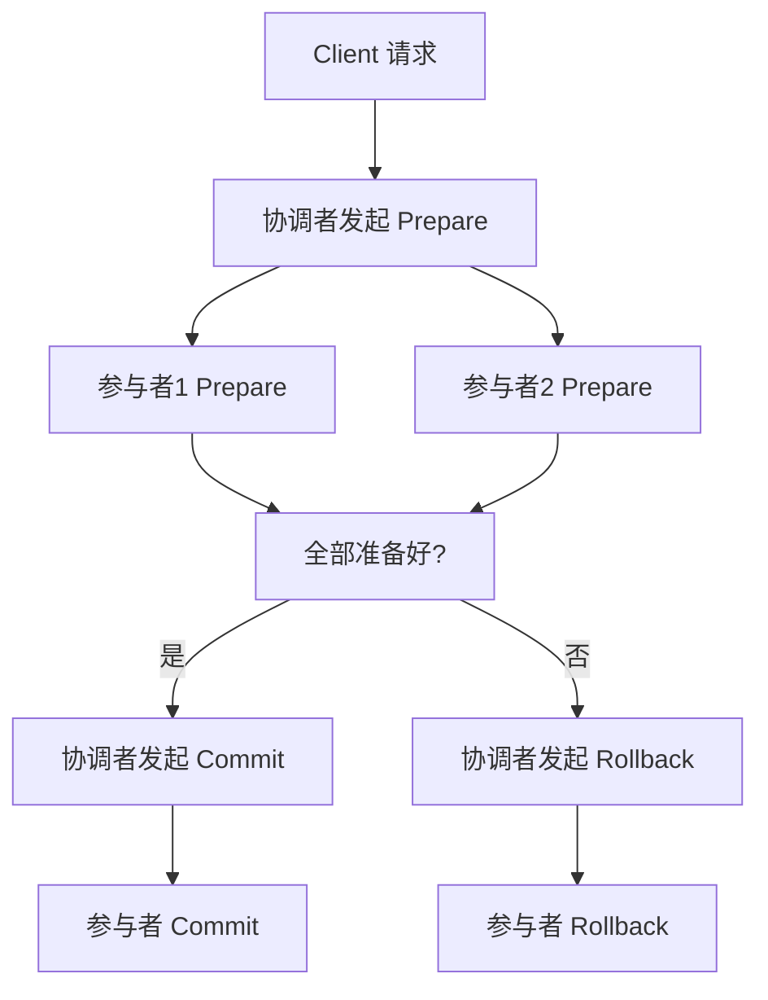

```mermaid
flowchart TD
  A["Client 请求"] --> B["协调者发起 Prepare"]
  B --> C1["参与者1 Prepare"]
  B --> C2["参与者2 Prepare"]
  C1 --> D["全部准备好?"]
  C2 --> D
  D -- 是 --> E["协调者发起 Commit"]
  D -- 否 --> F["协调者发起 Rollback"]
  E --> G["参与者 Commit"]
  F --> H["参与者 Rollback"]
``` 